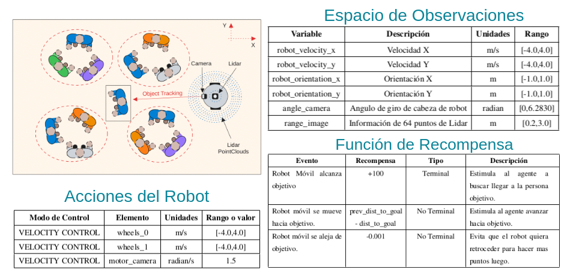
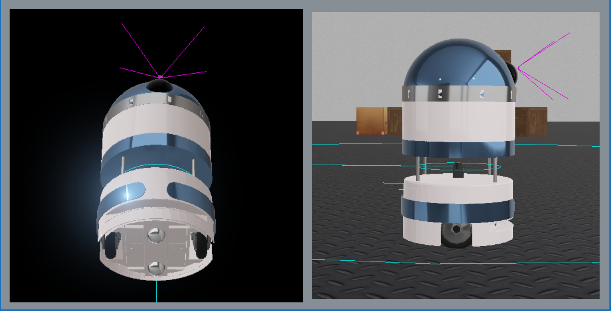
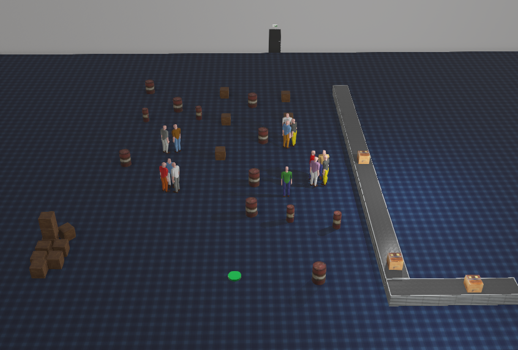
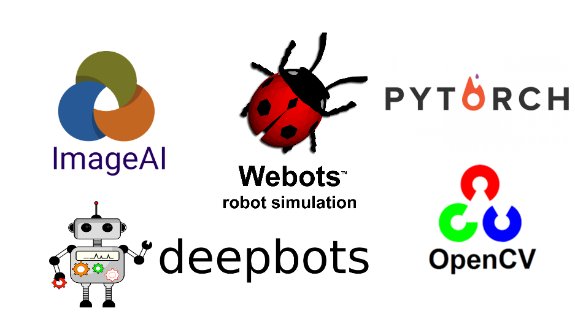
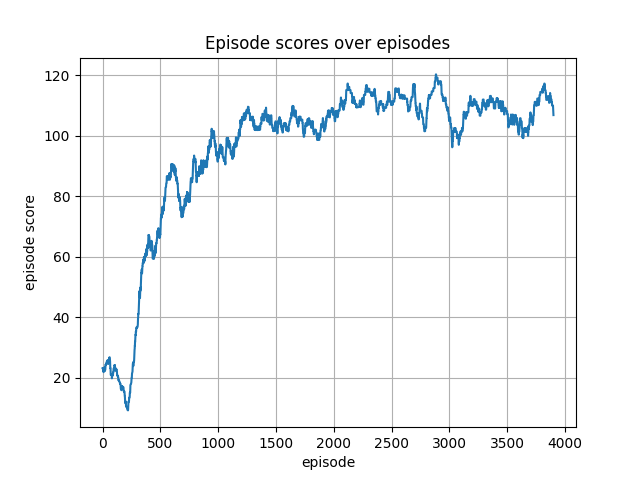

# ✨ Human Following Robot en Webots 🏃‍♀️🎥🤖 ✨

```diff

+ Deep Reinforcement Learning | + DDPG | + Computer Vision | + YOLO | + Webots | + Mobile robot | 
```


Este proyecto tuvo como objetivo implementar un entorno de Gimnasio en *Webots* (Simulador de Físicas para Robótica). La finalidad del proyecto se enfoca en construir y entrenar un Robot movil de configuración diferencial en la tarea de supervisión o seguimiento de personas, y cumplir este objetivo evitando colisionar con elementos del entorno que puedan poner en peligro al robot.  El Robot Móvil cuenta con una cámara RGB, un sensor LIDAR, dos actuadores que controlan el giro de las 2 ruedas que nueven al robot, un actuador que controla la dirección de visión de la cámara y 3 sensores (de rotación y velocidad de los diversos motores del robot). Específicamente, el robot deberá moverse en dirección de una persona virtual escogida a priori, y cuya inteligencia de toma de decisiones estará dada por la conjunción de dos modelos, el primero, es un modelo CNN muy ligero llamado **Tiny-Yolo v3** usado desde la librería de **Imageai** que realizará la detección de la persona virtual mediante las imagenes capturadas por la cámara y el segundo, es un modelo de Aprendizaje por Refuerzo profundo llamado **DDPG** extraido de la librería de **Deepworlds**, el cual actuará como el controlador de locomoción del robot.

## Características
<div id="features"></div>
<table>
  <tr>
    <td><h2> Analisis de Entorno </h2> </td>
  </tr>
  <tr>
    <td>
    En este proyecto se modelo un Entorno parcialmente observable por el agente robótico móvil, donde en cada instante de tiempo, el agente registrará los datos de observación de 64 mediciones de puntos del LIDAR, los datos de los sensores de orientación, rotación y velocidad, es importante mencionar que la orientacion de cámara actual es enviada también como observación. La orientación de la cámara dependerá de la dirección en la que la persona objetivo es detectada por el modelo YOLO. </td>
  </tr>
 </table>

 <div id="robot"></div>
<table>
  <tr>
    <td><h2> El Robot </h2> </td>
  </tr>
  <tr>
    <td>
    Desde el inicio, pensé en una configuración diferencial para mi robot, por la simplicidad de su locomoción, ya que solo depende de dos actuadores o motores por lo que ayuda a reducir la complejidad de acciones al momento de la busqueda de la política optima al entrenar el modelo DDPG, principalmente en Webots existen algunas opciones útiles de robots conocidos, uno de los robots que más llamo mi atención fue el robot Thiago Base de la empresa Pal Robotics que posee una configuración diferencial por ello partiendo de su modelo, elimine, modifique y añadi partes adicionales para terminar implementando mi robot personalizado, por ejemplo, mejores ruedas locas base, un torso con un sensor lidar centrado y una base giratoria como cabeza del robot, la cual ayuda a mover la cámara desde un angulo entre 0 a 360 grados. </td>
  </tr>
 </table>

  <div id="escenario"></div>
<table>
  <tr>
    <td><h2> El Escenario </h2> </td>
  </tr>
  <tr>
    <td>
    Webots contiene algunos escenarios por defecto, cada uno de ellos está compactado
como un conjunto de elementos visuales agrupados en un archivo .wbt, se decidió
partir del mundo factory.wbt, el cual se modificó agregando modelos pedestrian, barriles
cajas, etc. de manera que se implementó un entorno personalizado con la mayor
cantidad de obstaculos posibles tal como se muestra en la figura. </td>
  </tr>
 </table>

# Herramientas
<div id="features"></div>
<table>
  <tr>
    <td><h2> Herramientas Utilizadas </h2> </td>
  </tr>
  <tr>
    <td>
     Este proyecto no sería posible sin las maravillosas herramientas proporcionadas por Webots, imageai, deepbots, pytorch y openCV. </td>
  </tr>
 </table>

Referencias a las tecnologias y codificaciones usadas en este proyecto:

#### Las Maravillosas Librerías de Deepbots y Deepworlds:
1. De Deepbots extraje la forma de construir un entorno de Webots que se adaptable a OpenAiGym, el cual es la norma en aprendizaje por Refuerzo.
https://github.com/aidudezzz/deepbots/tree/dev
2. De Deepworlds obtuve el modelo DDPG usado en este proyecto.
https://github.com/aidudezzz/deepworlds

cuya referencia oficial es:

```bibtex
@InProceedings{10.1007/978-3-030-49186-4_6,
    author="Kirtas, M.
    and Tsampazis, K.
    and Passalis, N.
    and Tefas, A.",
    title="Deepbots: A Webots-Based Deep Reinforcement Learning Framework for Robotics",
    booktitle="Artificial Intelligence Applications and Innovations",
    year="2020",
    publisher="Springer International Publishing",
    address="Cham",
    pages="64--75",
    isbn="978-3-030-49186-4"
}
```

#### La Maravillosa Librería de Imageai:
https://github.com/OlafenwaMoses/ImageAI/tree/master
cuya referencia oficial es:
```bibtex
@misc {ImageAI,
    author = "Moses",
    title  = "ImageAI, an open source python library built to empower developers to build applications and systems  with self-contained Computer Vision capabilities",
    url    = "https://github.com/OlafenwaMoses/ImageAI",
    month  = "mar",
    year   = "2018--"
}
```
#### El maravilloso mundo de Webots, el simulador usado en este proyecto:

https://cyberbotics.com/

cuya referencia oficial es:

```bibtex
@MISC{Webots,
  AUTHOR = {Webots},
  TITLE  = {http://www.cyberbotics.com},
  NOTE   = {Open-source Mobile Robot Simulation Software},
  EDITOR = {Cyberbotics Ltd.},
  URL    = {http://www.cyberbotics.com}
}
```


# Entrenamiento

En este punto se entrenó al robot mediante aprendizaje por Refuerzo Profundo usando
DDPG con la finalidad de encontrar una correcta actuación de las ruedas para moverse
a lo largo del escenario. Sin embargo, para el entrenamiento del robot se optó por
colocar un cilindro achatado verde como meta de llegada, el cual por su altura es
indetectable por el LIDAR, con ello el robot no tomó a la meta como un obstáculo
y permitió un entrenamiento más fluido. Luego de 4000 episodios de entrenamiento
DDPG muestra un correcto control del robot para alzanzar la meta (cilindro verde) y
evasión de obstáculos puestos en el camino, puede ver esta demostración a continuación:

https://github.com/PatrichsInocenteCM274/Proyecto-Human-Following-Robot/assets/30361234/c2742a76-96fa-45dc-b36e-b9edf94f36d5

puede encontrar la demostración completa aqui: https://www.youtube.com/watch?v=5H-uahe66YI

<div id="features"></div>
<table>
  <tr>
    <td><h2> Resultados DDPG </h2> </td>
  </tr>
  <tr>
    <td>
      </td>
  </tr>
 </table>

# Poniendo a prueba

Luego del entrenamiento, se abandono el cilindro verde como meta y se coloco a la persona objetivo en su lugar, además la dirección de la cámara se mueve mediante la detección del modelo TinyYolov3 tal como se muestra a continuación:


https://github.com/PatrichsInocenteCM274/Proyecto-Human-Following-Robot/assets/30361234/f6ec3aac-ad90-47bf-8ebb-3b8e8080e3d0


puede encontrar la demostración completa aqui: https://www.youtube.com/watch?v=1CB4J9nSYHQ

## Instrucciones de Uso (Probado en Ubuntu 20.04 con GPU Nvidia):

Antes de seguir las instrucciones, asegurese de contar con una GPU y CUDA instalados en su maquina, sin ello se obtendrá un error debido a que DDPG ha sido entrenado mediante GPU y webots no podrá cargar el modelo.

### 1. Instalación 
Instale las siguientes librerias ingresando los siguientes comandos en su Terminal.
~~~
pip install cython pillow>=7.0.0 numpy>=1.18.1 opencv-python>=4.1.2 torch>=1.9.0 --extra-index-url https://download.pytorch.org/whl/cu102 torchvision>=0.10.0 --extra-index-url https://download.pytorch.org/whl/cu102 pytest==7.1.3 tqdm==4.64.1 scipy>=1.7.3 matplotlib>=3.4.3 mock==4.0.3
~~~
~~~
pip install deepbots imageai
~~~
~~~
sudo apt-get install python3-tk
~~~
Instale Webots, para ello dirijase a la pagina https://cyberbotics.com/doc/guide/installing-webots.

### 2. Ejecutando Simulación
1. Clone este proyecto en su computadora.

2. Abra Webots y navegue a la opción File >> Open World...

3. Dentro del navegador de archivos dirijase a la ubicaciòn donde clonó el proyecto y acceda a la carpeta worlds y seleccione factory.wbt
Usted deberá observar lo siguiente:


4. Usted se encuentra en el camino correcto, si la simulaciòn no se ejecuta automàticamente solo debe seleccionar el boton ▶️ que iniciará la simulación. A continuaciòn el robot empezará a detectar a la persona objetivo y la seguirá, cabe notar que la velocidad en simulación es lenta debido al pequeño delay de detección del modelo Yolo, por lo que no se preocupe si la simulación se ejecuta con bajos fps, puede grabar la simulación usando la herramienta de grabación de webots.


